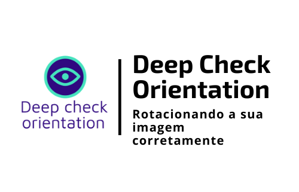

<h1 align="center">
    
</h1>

<h4 align="center"> 
	🚧 Deep Check Orientation 1.0 🚀 em desenvolvimento... 🚧
</h4>

  

  

  	
  
	
  
  

  
   

## 💻 Sobre o projeto

📷 **Deep Check Orientation** é um projeto que utiliza *aprendizado profundo (deep learning)* para **verificação da orientação de uma imagem** e **rotação adequada da mesma**. Ao ser enviada uma imagem (em qualquer formato), **retorna-se o número de rotações necesárias e a imagem rotacionada corretamente**.

Os passos realizados são:
1) Leitura da imagem em rgb
2) Pipeline de aumento de imagem usando albumentations (classe: compose)
3) Realização da predição usando uma rede neural do tipo resnet
4) Obtenção das predições de orientação da imagem
5) Cálculo do número de rotações necessárias para orientação correta da imagem.

Projeto desenvolvido utilizando a rede **swsl_resnext50_32x4d** oferecida pelo [Ternaus].

## 🛠  Tecnologias

As seguintes ferramentas foram usadas na construção do projeto:

- [Python]

## 🚀 Como executar o projeto

1. pip install requirements.txt
2. Abrir a linha de comando (cmd) e digitar: python main.py <imagem_para_rotacionar>. 
Ex: python main.py "..\allPd.jpg".
3. A rede neural (**swsl_resnext50_32x4d**) é baixada e armazenada na primeira execução do projeto e após isso, utiliza-se a rede já baixada. 

Caso queira baixar manualmente e referenciar no projeto, deve-se realizar os seguintes passos.

 1. Download usando o link de pesos na seção de **Modelo pré-treinado** desse README. Após o download, extrair a pasta.
 2. Colocar o arquivo zipado e o extraído em uma pasta qualquer.
 3. Criar uma variável de ambiente: **TORCH_HOME = caminho_rede_neural**. 
Ex: TORCH_HOME = C:\Users\EmersonRafael\Desktop\DEEP_CHECK_ORIENTATION\model_dir_check_orientation

## ➊ Pré-requisitos

Antes de começar, você vai precisar ter instalado em sua máquina as seguintes ferramentas (O download pode ser realizado pela própria página do Python ou Anaconda):
[Python](https://www.anaconda.com/products/individual).

## 🧠 Modelo pré-treinado
Modelo foi treinado por [Ternaus] usando o [OpenImages dataset](https://storage.googleapis.com/openimages/web/index.html).

| Modelo        | Acurácia de validação | Arquivo de configuração  | Pesos |
| ------------- |:--------------------:| :------------:| :------: |
| swsl_resnext50_32x4d|0.9128| [Link](check_orientation/configs/2020-11-16.yaml)| [Link](https://github.com/ternaus/check_orientation/releases/download/v0.0.3/2020-11-16_resnext50_32x4d.zip)|

## 📝 Licença

Este projeto está sob a licença MIT.

Feito com ❤️ por Emerson Rafael 👋🏽 [Entre em contato!](https://www.linkedin.com/in/emerson-rafael/)

[Ternaus]: https://github.com/ternaus/check_orientation
[Python]: https://www.python.org/downloads/